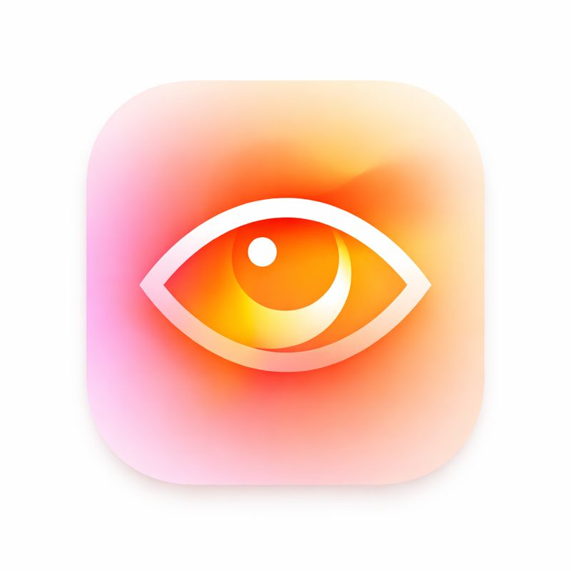
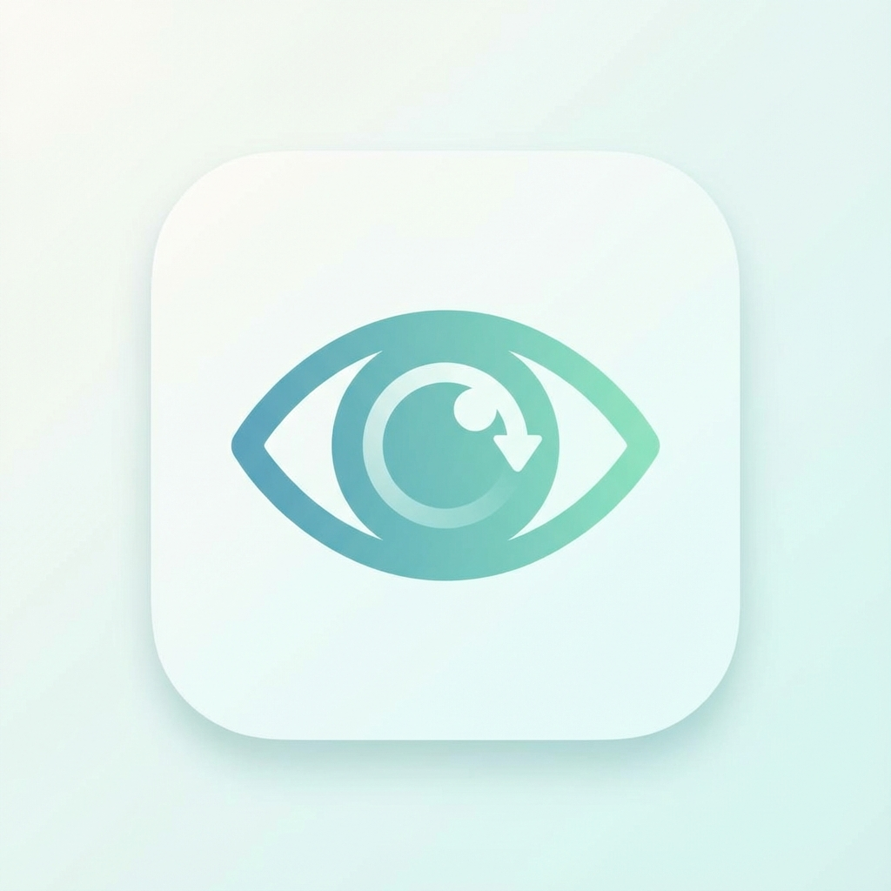

<p align="center">
  
</p>

<h1 align="center">Sight</h1>

<p align="center">
  <strong>Your personal vision health companion for macOS</strong>
</p>

<p align="center">
  
  
  
  
</p>

<p align="center">
  <a href="#installation">Installation</a> •
  <a href="#features">Features</a> •
  <a href="#screenshots">Screenshots</a> •
  <a href="#usage">Usage</a> •
  <a href="#privacy">Privacy</a>
</p>

---

## Overview

Sight is a premium macOS menu bar app that protects your eyes using the scientifically-backed **20-20-20 rule** — every 20 minutes, look at something 20 feet away for 20 seconds.

Built natively with SwiftUI and designed to feel right at home on macOS.

---

## Installation

### Download

Download the latest release from the [Releases](https://github.com/Kumar-Gaurav-1/Sight/releases) page.

1. Open `Sight-Installer.dmg`
2. Drag **Sight** to your Applications folder
3. Launch from Applications

### Build from Source

```bash
git clone https://github.com/Kumar-Gaurav-1/Sight.git
cd Sight
swift build -c release
```

Or open `Package.swift` in Xcode and press `⌘R`.

---

## Features

### Break Reminders

| Feature | Description |
|---------|-------------|
| **20-20-20 Rule** | Scientifically-backed eye care intervals |
| **Customizable Timers** | 10–60 min work, 20–300 sec breaks |
| **Pre-Break Warnings** | Configurable countdown before breaks |
| **Skip & Postpone** | Delay breaks by 5 minutes when needed |

### Smart Detection

| Feature | Description |
|---------|-------------|
| **Meeting Detection** | Auto-pauses during calendar events |
| **Fullscreen Detection** | Won't interrupt videos or presentations |
| **Screen Recording** | Pauses during recordings |
| **Idle Detection** | Pauses when you step away |
| **Work Hours** | Only active during your schedule |

### Wellness Nudges

| Nudge | Purpose |
|-------|---------|
| **Blink Reminder** | Reduces dry eyes from prolonged focus |
| **Posture Check** | Gentle reminders to sit up straight |
| **Mini Exercise** | Quick stretch suggestions |
| **Overtime Alert** | Warns when you've been working too long |

### Premium Experience

- **Beautiful Overlays** — Full-screen calming gradients with breathing guide
- **Statistics Dashboard** — Track streaks and daily adherence
- **Achievements** — Earn badges for healthy habits
- **Global Shortcuts** — Control from anywhere
- **Native Design** — Follows macOS Human Interface Guidelines

---

## Screenshots

<p align="center">
  
</p>

---

## Usage

### Menu Bar

| Action | Result |
|--------|--------|
| **Click** | Open dashboard |
| **⌥ + Click** | Toggle pause/resume |

### Keyboard Shortcuts

| Shortcut | Action |
|----------|--------|
| `⌘⌃P` | Pause / Resume |
| `⌘⌃B` | Take break now |
| `⌘⌃S` | Skip break |
| `⌘,` | Preferences |
| `Esc` | Dismiss overlay |

### Status Indicator

| Color | State |
|-------|-------|
| � Green | Timer active |
| � Orange | Paused |
| 🔵 Cyan | On break |
| ⚪ Gray | Idle |

---

## Requirements

| Requirement | Version |
|-------------|---------|
| macOS | 13.0+ (Ventura) |
| Architecture | Apple Silicon & Intel |

### Permissions

| Permission | Purpose |
|------------|---------|
| **Notifications** | Break reminders |
| **Accessibility** | Global shortcuts |
| **Calendar** | Meeting detection (optional) |

---

## Privacy

Sight is designed with privacy as a core principle:

- ✅ **100% Offline** — No network requests, ever
- ✅ **No Data Collection** — Your data stays on your Mac
- ✅ **No Accounts** — Just install and use
- ✅ **Calendar Privacy** — Only checks meeting times, not details

---

## Performance

| Metric | Value |
|--------|-------|
| CPU (idle) | < 1% |
| Memory | ~ 40 MB |
| Battery | Negligible |

### Optimizations

- Event-driven architecture (no polling)
- Combine publishers for reactive updates
- Metal-accelerated overlay rendering
- Lazy UI updates

---

## Project Structure

```
Sight/
├── Sources/Sight/
│   ├── App/                 # Main entry & delegate
│   ├── Core/                # Timer, sounds, detection
│   ├── MenuBar/             # Menu bar interface
│   ├── Preferences/         # Settings UI
│   ├── Onboarding/          # First-run experience
│   ├── Overlay/             # Break overlay views
│   ├── Nudges/              # Wellness reminders
│   ├── UI/                  # Nudge views
│   ├── State/               # Statistics & adherence
│   └── Input/               # Keyboard shortcuts
└── Tests/                   # Unit tests
```

---

## Contributing

1. Fork the repository
2. Create a feature branch
3. Commit your changes
4. Push and open a Pull Request

---

## License

MIT License — see [LICENSE](LICENSE) for details.

---

<p align="center">
  <sub>Built with SwiftUI • Designed for macOS</sub>
</p>

<p align="center">
  <sub>Made with care for healthier screen time 👁</sub>
</p>
